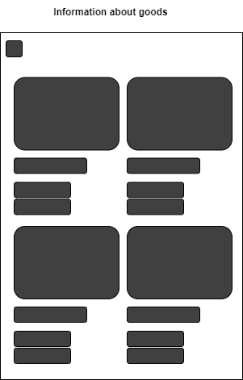
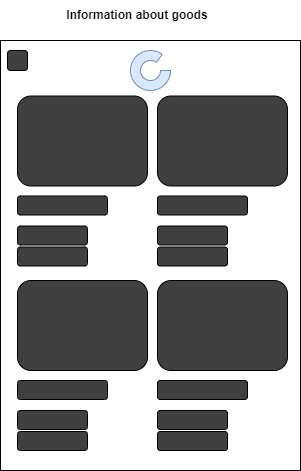

| NFR ID | Test Case ID | Опис кроків тестового сценарію          | Опис очікуваних результатів                       |
|:------:|:------------:|:---------------------------------------:|:-------------------------------------------------:|
| NFR1.1 | TC1.5        | Початкові умови: відсутні               | Екрана форма:                                     |
|        |              | Кроки сценарію: відсутні                |                  |
| NFR1.1 | TC1.6        | Початкові умови: успішно пройдені TC1.5 | Екрана форма:                                     |
|        |              | Кроки сценарію: проведння по екрану згори вниз                         |   |
| NFR1.1 | TC1.7        | Початкові умови: успішно пройдені TC1.6 | Екрана форма:                                     |
|        |              | Кроки сценарію: відстуні                |                  |
